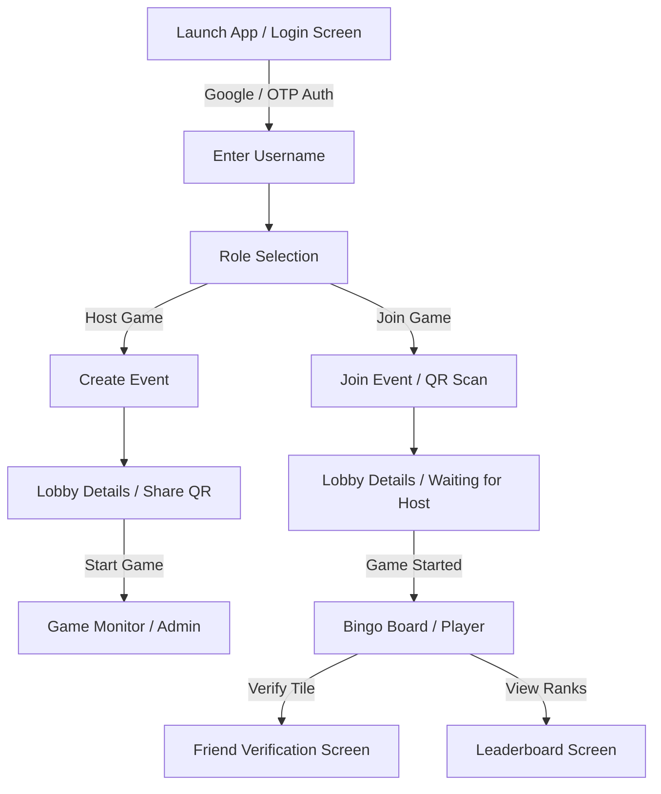

# amMingo Mobile Client 📱

[](https://flutter.dev)
[](https://dart.dev)
[](https://www.android.com)

The premium, interactive Flutter client application for **amMingo**—the open-source alternative to Human Bingo. It features a fully responsive gameplay grid, live leaderboard metrics, profile verification code sharing, and a built-in QR scanner to instantly join game events.

---

## ✨ Features
* **Authentication:** Google OAuth2 sign-in and passwordless OTP verification.
* **Responsive Bingo Grid:** Custom adaptive board sizes (`3x3`, `4x4`, `5x5`) scaling dynamically depending on lobby participant size.
* **QR Scanner:** Integrated QR code camera reading for rapid event entries.
* **Camera Integration:** Fast photo-capturing and uploading to back-verify cell markings.
* **Real-time Synchronization:** Constant background polling of game timers and leaderboard statuses.
* **Premium Theme system:** Clean light/dark color palettes and smooth animations.

---

## 📱 App Sitemap & Navigation



---

## 🚀 Local Development Setup

### Prerequisites
1. Install [Flutter SDK](https://docs.flutter.dev/get-started/install) (stable channel).
2. Install Android Studio / Xcode for emulators and physical device drivers.

---

### Installation & Run

1. **Clone the repository:**
   ```bash
   git clone https://github.com/Rufine777/amMingo-frontend.git
   cd amMingo-frontend
   ```

2. **Fetch dependencies:**
   ```bash
   flutter pub get
   ```

3. **Running on Physical Android Devices (Recommended):**
   To allow physical mobile devices to communicate directly with your local backend running on `localhost:8000`, configure ADB port forwarding:
   
   ```bash
   # Reverse port forwarding from device to host machine
   adb reverse tcp:8000 tcp:8000
   ```

4. **Launch the application:**
   Ensure you have a simulator running or a physical device connected:
   ```bash
   flutter run
   ```

---

## 📦 Building the App

To generate a deployable release bundle for Android devices:

```bash
# Build a release APK
flutter build apk --release
```
*The output APK will be generated at: `build/app/outputs/flutter-apk/app-release.apk`*

---

## 🧹 Code Quality & CI Guidelines
* **Code Formatting:** Make sure you format your code before creating pull requests:
  ```bash
  dart format .
  ```
* **Static Analysis:** Keep the analyzer 100% clean of errors and warnings:
  ```bash
  flutter analyze
  ```